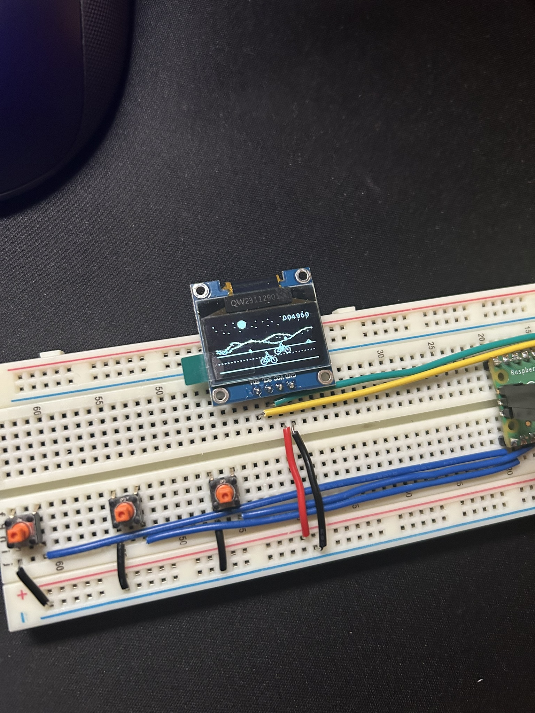

# Bike with friends

## A game about riding bikes with friends

### Running on RP2040 with a SSD1306 128 x 64 display



Wrote this as a way for me to learn Rust & RP2040. Also part of a sharable [PCB project](https://dazgupta.com/journal/00020_biking_with_friends/) that I have been working on.

## Development

```bash
cargo run
```
## What is the game about?

I go on bike rides with friends across Scandinavia every year with my friends. This game was just me playing with that idea.

## TODO:
 - Add instructions for hooking up the buttons and displays.
 - Add how to play instructions.
 - Add start screen & play-pause?

